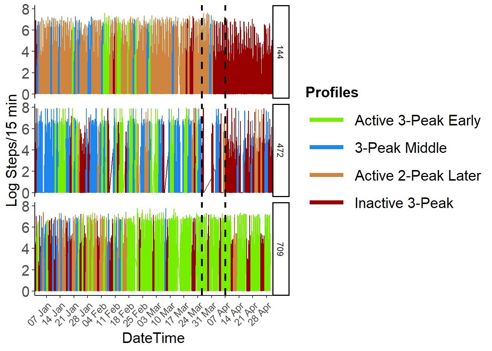
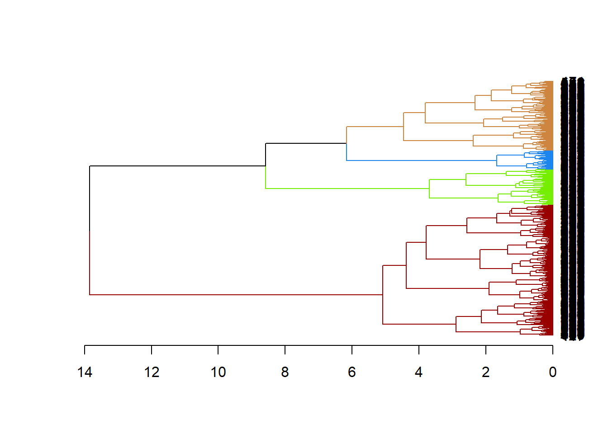
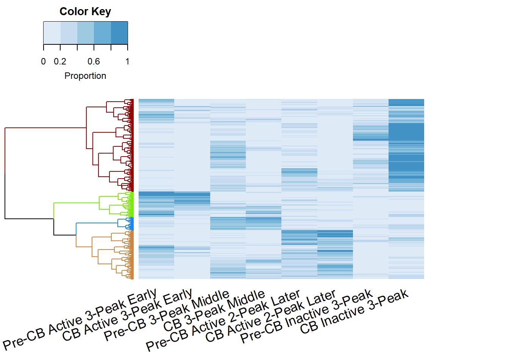
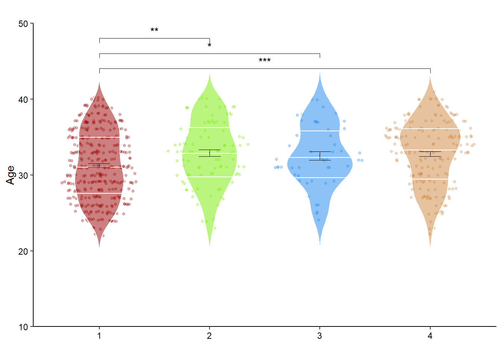
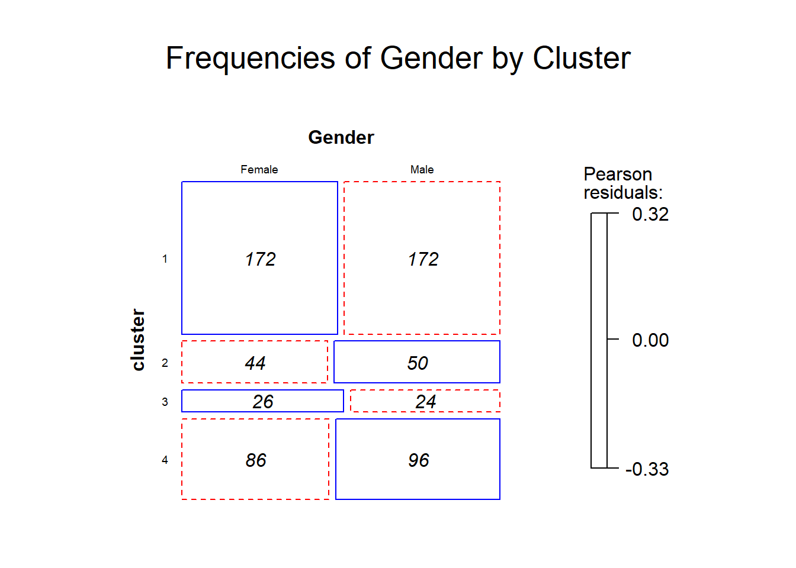
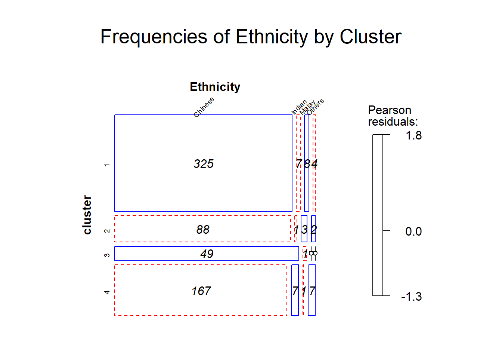
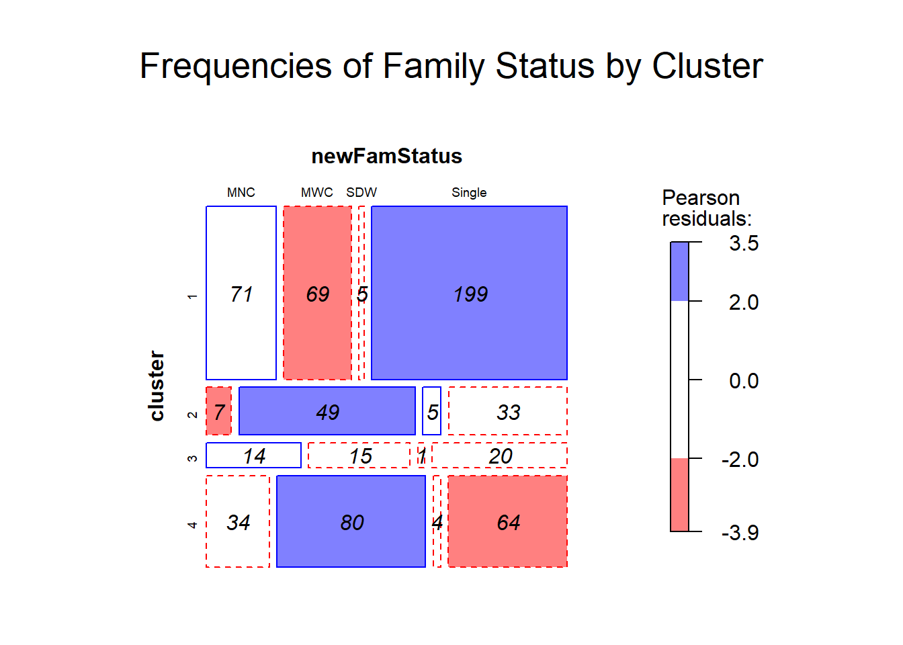
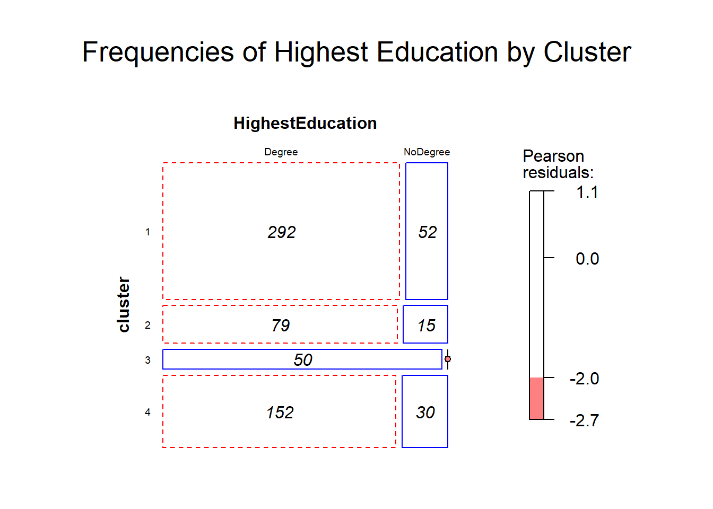
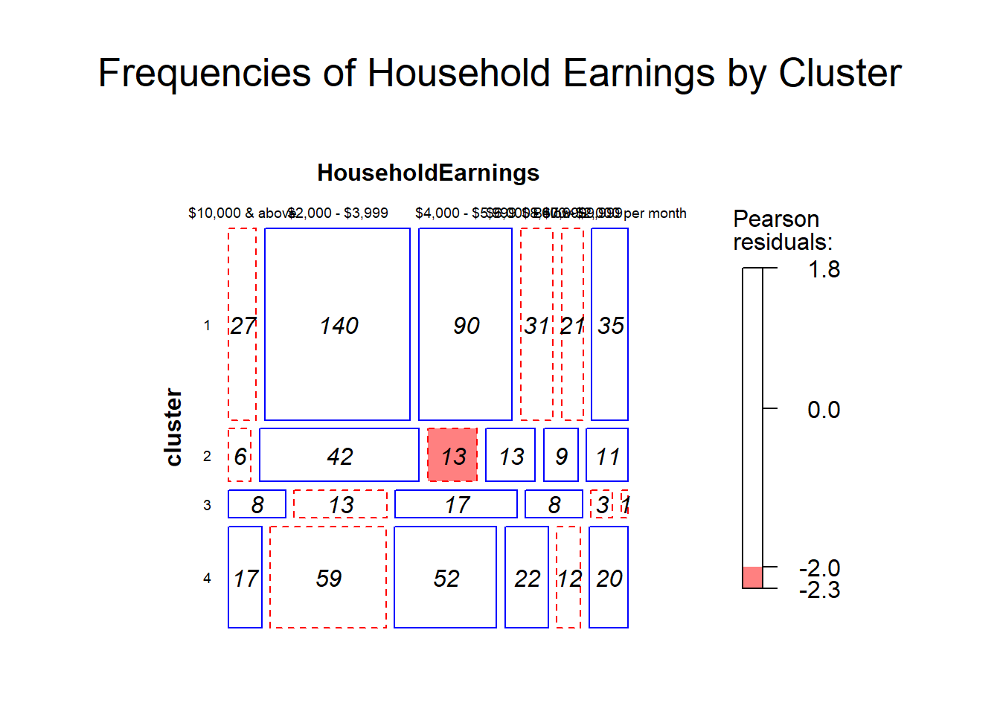

Rest Activity Rhythms During COVID19 Pandemic
================

Author: TeYang, Lau <br> Last Updated: 6 June 2020


# 1\. Data Loading

``` r
## Load Packages 
library(tidyverse); library(knitr); library(kableExtra); library(formattable); library(patchwork); library(zoo);
library(GGally); library(ggExtra); library(stargazer); library(car); library(factoextra); library(NbClust);
library(ggplot2); library(scales); library(ggforce); library(ggpubr); library(gmodels); library(vcd); 
library(rstatix); library(ez); library(dendextend); library(hrbrthemes); library(emmeans); library(psych)


## Load Data
steps <- read.csv('./Data/steps_wide_cleaned_JANtoAPR2020_allsubjs_validdays.csv', header = TRUE)
L2 <- read.csv('./Data/Euclideank4k5.csv', header = F) %>%
  rename('cluster_k4_L2' = 'V1', 'cluster_k5_L2' = 'V2') %>% select(cluster_k4_L2)

# Reorder cluster assignments so that clusters are in ascending order in N size
L2$cluster_k4_L2 <- match(L2$cluster_k4_L2, names(sort(table(L2$cluster_k4_L2))))
L2$cluster_k4_L2 <- match(L2$cluster_k4_L2, names(sort(table(L2$cluster_k4_L2))))
L2$cluster_k4_L2 <- match(L2$cluster_k4_L2, c(1,3,2,4)) # swap 3 and 2 so that 2 is middle and 3 is later group

## Rename columns
tod_15min <- as.character(read.table("./Data/tod_15min.txt")[,1]) # load text file with 24hr time in 15min intervals
names(steps)[3:98] <-c(tod_15min)

head(steps[,1:24])
##           DRID       Date 00:00 00:15 00:30 00:45 01:00 01:15 01:30 01:45 02:00
## 1 0005E6C2E97A 2020-01-07     0     0     0     0     0     0     0     0     0
## 2 0005E6C2E97A 2020-01-16     0     0     0     0    17     0     0     0     0
## 3 0005E6C2E97A 2020-01-18     0     0     0     0     0    19     0     0     0
## 4 0005E6C2E97A 2020-01-25     0     0     0     0     0     0     0     0     0
## 5 0005E6C2E97A 2020-02-20     0     0     0     0     0     0     0     0     0
## 6 0005E6C2E97A 2020-03-13     0     0     0     0     0     0     0     0     0
##   02:15 02:30 02:45 03:00 03:15 03:30 03:45 04:00 04:15 04:30 04:45 05:00 05:15
## 1     0     0     0     0     0     0     0     0     0     0     0     0     0
## 2     0     0     0     0     0     0     0     0     0     0     0     0     0
## 3     0     6     0     0     0     0     0     0     0    11     0     0     0
## 4     0     0     0     0     0     0     0     0     0     0     0     0     0
## 5     0     0     0     0     0     0     0     0     0     0     0     0     0
## 6     0     0     0     0     0     0     0     0     0     0     0     0     0
```

<br>

# 2\. Data Cleaning

<font size="4">

1.  Steps Data on Weekdays

2.  First 28 days

3.  At least 10 Weekdays

4.  Filter days out:
    
      - Total Steps \> 50000
      - Total Steps \> 40000 & Sedentary Minutes \> 1320 min
      - Sedentary Minutes == 1440 min
      - No Resting Heart Rate
      - WearTime \< 780 min

</font>

# 3\. Kmeans Clustering Steps

<br>

``` r
## Log Steps
# log steps and replace -Inf with 0
steps_log <- log(steps[-1:-2]) %>% anchors::replace.value(., c(1:96), from=-Inf, to=0) %>% 
  mutate(DRID = steps$DRID, Date = steps$Date) %>% select(DRID,Date,everything())

steps_log <- cbind(steps_log, L2) %>% mutate(cluster_k4_L2=factor(cluster_k4_L2))
```

<br>

## 3.1. Rest Activity Rhythm Profile Plots

``` r

# Euclidean cluster aggregate
steps_agg_log_k4_L2 <- aggregate(steps_log[, 3:98],
                           by = list(steps_log$cluster_k4_L2),
                           FUN = mean)


## Plot Cluster Profiles
#### Euclidean Distance 

color4 <- c("chartreuse2","dodgerblue2",'tan3',"#990000")

par(mar=c(5,6,3,2))
plot(0,0,xlim = c(0,95),ylim = c(0,5.5),type = "n", xlab='Time of Day', ylab='Log Steps/15 min', xaxt="n", yaxt='n', cex.lab=2) # create empty plot for line graphs
axis(1, at=c(0,47,95),labels=c('12am', '12pm', '12am'),cex.axis=2, tck=-0.02)
for (i in 1:4){
  lines(c(0:95),steps_agg_log_k4_L2[i,-1], col = color4[steps_agg_log_k4_L2$Group.1[i]], lwd = 3)
}
title(main="K-means Euclidean Distance Clustering\nK=4")
legend("topleft", legend=c(paste('Active 3-Peak Early, days =',as.character(table(steps_log$cluster_k4_L2)[1]),sep=' '),
                           paste('3-Peak Middle, days =',as.character(table(steps_log$cluster_k4_L2)[2]),sep=' ')),
       col=color4, lty=1, lwd=3, cex=1, bty='n')
legend("bottomright", legend=c(paste('Active 2-Peak Later, days =',as.character(table(steps_log$cluster_k4_L2)[3]),sep=' '),
                           paste('Inactive 3-Peak, days =',as.character(table(steps_log$cluster_k4_L2)[4]),sep=' ')),
       col=color4[3:4], lty=1, lwd=3, cex=1, bty='n')
axis(2, cex.axis=2, tck=-0.02)
```


## 3.2. Individual Time Series RAR Plots

``` r
# Get some samples for plotting
samp <- c("439CD3EEBF37", "13F9D36BC9AC", "63A98BD38B70")
# "CCC8BC39C073" "B7891B5C3B02" "D0C79BF6A82A" "439CD3EEBF37" "13F9D36BC9AC" "63A98BD38B70"
sampledf <-  data.frame()
for(i in 1:length(samp)) {
  id <- samp[i]
  subjnum <- which(as.character(unique(steps_log$DRID)) %in% id)
  indiv_steps <- filter(steps_log, DRID==id) %>% arrange(Date)
  indiv_steps_long <- gather(indiv_steps, Time, Steps, 3:98) %>% arrange(Date,Time) %>% mutate(DateTime = as.POSIXct(paste(Date,Time)))
  indiv_steps_long <- indiv_steps_long %>% mutate(index=rep(subjnum, dim(indiv_steps_long)[1]))
  sampledf <- rbind(sampledf, indiv_steps_long)
}

# Plot
par(mar=c(5,6,3,6))
p <- ggplot(sampledf, aes(DateTime, Steps, color=cluster_k4_L2)) + geom_path(aes(group=1)) +
          theme_classic() +
          ylab('Log Steps/15 min') +
          #scale_fill_manual(name = "Cluster", breaks = c("Delayed", "Most Active", "Least Active")) +
          scale_colour_manual('Profiles',values=color4, breaks=c("1", "2", "3", "4"), labels=c("Active 3-Peak Early", "3-Peak Middle", "Active 2-Peak Later", "Inactive 3-Peak"),
        guide=guide_legend(keywidth=3, override.aes = list(size = 2)),                              ) +
          scale_x_datetime(labels=date_format('%d %b', tz='Singapore'), date_breaks = '7 days', expand=c(0,0.9)) +
          theme(axis.text.x=element_text(angle=45, hjust=1, size=10), legend.key.size = unit(1, "cm"),legend.title = element_text('Profiles', size=15, face="bold"), 
        legend.text = element_text(size=15), axis.text.y = element_text(size=15), axis.title=element_text(size=15), 
        plot.title = element_text(hjust = 0.5)) + 
  geom_vline(xintercept=as.numeric(as.POSIXct(c('2020-03-26','2020-04-7'))), linetype='dashed', lwd=1, color = "black")

p + facet_grid(rows=vars(index))
```

 <br>

# 4\. Hierarchical Clustering of Proportion of Time Spent in each Profile

## 4.1. Clean and wrangle

``` r
# Fill in missing days
uniqueID = unique(steps_log$DRID)
DRID = rep(uniqueID, each = 118)
Date = rep(seq(as.Date('2020-01-01'),as.Date('2020-04-27'), by='1 day'), times = length(unique(steps_log$DRID)))
fulldays = data.frame(DRID, Date) # create dataframe with full 118 days since day start for each ID

steps_period <- steps_log %>% select(DRID,Date,cluster_k4_L2) %>% 
                           mutate(Date = as.Date(as.character(Date))) %>% filter(Date <= '2020-04-27')
alldaysteps <- full_join(fulldays, steps_period)

# Filter Ps with enough days
preeligible <- steps_log %>% mutate(Date=as.Date(as.character(Date))) %>% filter(Date < '2020-04-07') %>% group_by(DRID) %>% summarise(predays = n()) %>% 
  filter(predays >= 59) %>% as.data.frame() # 59/97 days for pre-cb 60%
posteligible <- steps_log %>% mutate(Date=as.Date(as.character(Date))) %>% filter(Date >= '2020-04-07' & Date <= '2020-04-27') %>%
  group_by(DRID) %>% summarise(postdays = n()) %>% filter(postdays >= 13) %>% as.data.frame() # 13/21 days for pre-cb
eligible <- merge(preeligible, posteligible) 
#eligible <- filter(eligible, !DRID %in% c('A4596E5A98F6', 'F2D312B33D63'))

alldaysteps <- filter(alldaysteps, DRID %in% eligible$DRID)

long <- alldaysteps %>% mutate(Date = as.POSIXct(Date, format='%Y-%m-%d', tz='Singapore'))

events <- data.frame(n=c('First\nCase','Chinese\nNew Year','Health Alert\nLevel Raised','WHO Pandemic','Malaysia\nBorder Closure','Pubs Closure*', 'Circuit Breaker'), Date=as.POSIXct(c('2020-01-21','2020-01-27','2020-02-08','2020-03-08','2020-03-17','2020-03-26','2020-04-7')))
```

<br>

## 4.2. Proportion of time spent in each profile

``` r
# K4_L1

# Proportion of time spent in each state Pre-Circuit Breaker
precb <- long %>% filter(Date <'2020-04-07') %>% filter(!is.na(cluster_k4_L2)) %>% group_by(DRID) %>% 
  mutate(ndays=n()) %>% as.data.frame() %>% # get total days for each subject with no NAs
  group_by(DRID,cluster_k4_L2) %>% 
  summarize(proportion=n()/ndays[1]) %>% as.data.frame() %>%
  spread(., cluster_k4_L2, proportion) 
precb[is.na(precb)] <- 0
names(precb)[2:5] <-c("Pre-CB Active 3-Peak Early", "Pre-CB 3-Peak Middle",'Pre-CB Active 2-Peak Later', "Pre-CB Inactive 3-Peak")

# Proportion of time spent in each profile During Circuit Breaker
duringcb <- long %>% filter(Date >= '2020-04-07') %>% filter(!is.na(cluster_k4_L2)) %>% group_by(DRID) %>% 
  mutate(ndays=n()) %>% as.data.frame() %>% # get total days for each subject with no NAs
  group_by(DRID,cluster_k4_L2) %>% 
  summarize(proportion=n()/ndays[1]) %>% as.data.frame() %>%
  spread(., cluster_k4_L2, proportion)
duringcb[is.na(duringcb)] <- 0
names(duringcb)[2:5] <-c("CB Active 3-Peak Early",  "CB 3-Peak Middle", 'CB Active 2-Peak Later', "CB Inactive 3-Peak")

preduringcb_k4_L2 <- merge(precb,duringcb,by='DRID')
preduringcb_k4_L2 <- preduringcb_k4_L2[,c(1,2,6,3,7,4,8,5,9)]

#z-score features
# preduringcb_k4_L2 <- preduringcb_k4_L2 %>% select(-DRID) %>% scale(.) %>% as.data.frame() %>% 
#   mutate(DRID = precb$DRID) %>% select(DRID, everything())

head(preduringcb_k4_L2)
##           DRID Pre-CB Active 3-Peak Early CB Active 3-Peak Early
## 1 01649F4AE947                 0.37234043             0.00000000
## 2 01E802FE0EB8                 0.28947368             0.07692308
## 3 030400C90A1B                 0.07368421             0.00000000
## 4 0326D16F595E                 0.29032258             0.07142857
## 5 03F2F15F67BC                 0.12658228             0.00000000
## 6 043E928B6255                 0.54639175             0.20000000
##   Pre-CB 3-Peak Middle CB 3-Peak Middle Pre-CB Active 2-Peak Later
## 1            0.1063830        0.0000000                 0.17021277
## 2            0.5131579        0.3076923                 0.14473684
## 3            0.5473684        0.2380952                 0.28421053
## 4            0.5913978        0.6428571                 0.03225806
## 5            0.2784810        0.0625000                 0.26582278
## 6            0.1958763        0.2000000                 0.20618557
##   CB Active 2-Peak Later Pre-CB Inactive 3-Peak CB Inactive 3-Peak
## 1              0.0000000             0.35106383         1.00000000
## 2              0.4615385             0.05263158         0.15384615
## 3              0.0952381             0.09473684         0.66666667
## 4              0.2142857             0.08602151         0.07142857
## 5              0.0000000             0.32911392         0.93750000
## 6              0.3500000             0.05154639         0.25000000
```

<br>

## 4.3. Hierarchical Clustering

### Dendrogram and heatmap

``` r

# hierarchical clustering
res.dist <- dist(preduringcb_k4_L2[-1], method = "euclidean")
res.hc <- hclust(d = res.dist, method = "ward.D2")

# customize dendrogram
dend <- as.dendrogram(res.hc)
# Color the branches based on the clusters:
dend <- color_branches(dend, col=c("#990000","chartreuse2","dodgerblue2",'tan3'), k=4) 
plot_horiz.dendrogram(dend, side = F)
```



``` r
grp <- c(1:670)
dendClus <- dendextend:::cutree(res.hc, k=4, order_clusters_as_data = FALSE) # order of dendrogram
ord <- order.dendrogram(dend) # index of original dataframe corresponding to cluster assignment in dendClus
grp[ord] = dendClus
```

``` r
# assign clustering group
preduringcb_k4_L2 <- preduringcb_k4_L2 %>% mutate(cluster=grp)

ppcb_long_k4_L2 <- merge(long,preduringcb_k4_L2 %>% select(DRID,cluster), by='DRID') %>%
  mutate(DRID=as.factor(as.character(DRID))) %>% arrange(cluster,DRID,Date)
ppcb_long_k4_L2 <- ppcb_long_k4_L2 %>% mutate(idx=as.factor(rep(c(1:670),each = 118)))


dend <- dend %>% rotate(670:1) # rev dendrogram for plotting
## Heatmap with Dendrogram of Hierarchical Clustering
par(mar=c(10,6,4,2))
gplots::heatmap.2(as.matrix(preduringcb_k4_L2 %>% select(-DRID,-cluster)), 
          #main = "Heatmap for the Iris data set",
          srtCol = 20,
          dendrogram = "row",
          Rowv = dend,
          Colv = "NA", # this to make sure the columns are not ordered
          trace="none",
          labRow = F,
          cexRow = 0.1,
          margins =c(7,7),      
          key.xlab = "Proportion",
          denscol = "grey",
          density.info = "none",
          col=RColorBrewer::brewer.pal(9,"Blues")[2:6]
          )
```

 <br>

### Propotion of each profile state throughout COVID19

``` r

## Stacked Area Chart of Proportion Spent in Each State
stacked <- long %>% filter(!is.na(cluster_k4_L2)) %>% filter(Date >= '2020-01-02') %>% group_by(Date, cluster_k4_L2) %>% 
  summarise(n = n()) %>% mutate(Proportion=n/sum(n))
stackprop <- ggplot(stacked, aes(x=Date, y=Proportion, fill=factor(cluster_k4_L2))) + 
  geom_area(alpha=0.6 , size=1) +
  scale_x_datetime(expand = c(0, 0)) +
  scale_y_continuous(expand = c(0, 0)) +
  scale_fill_manual(values = c("chartreuse2","dodgerblue2",'tan3',"#990000"),na.value = "gray30", name='Clusters', labels=c("Active 3-Peak Early", "3-Peak Middle","Active 2-Peak Later", 'Inactive 3-Peak')) +
  theme(axis.line=element_blank(), panel.grid.major = element_blank(), panel.grid.minor = element_blank(), 
        axis.ticks = element_blank(), axis.text=element_text(color='black')) +
  geom_vline(xintercept=as.numeric(as.POSIXct(c('2020-04-7'))), linetype='dashed', lwd=1, color = "black") + 
  annotation_custom(
      grob = grid::textGrob(label = 'Circuit\nBreaker', hjust = 0, gp = grid::gpar(cex = 0.8)),
      ymin = 0.08,      # Vertical position of the textGrob
      ymax = 0.08,
      xmin = events$Date[7] + 86400,         # Note: The grobs are positioned outside the plot area
      xmax = events$Date[7] + 86400) 
  
# Top Event Bar
g2 <- data.frame(Date) %>% filter(Date != '2020-01-01') %>%  # remove 1 Jan
  mutate(Weekday = factor(as.numeric(timeDate::isWeekday(Date))), Date=as.POSIXct(Date, format='%Y-%m-%d', tz='Singapore'))
topbar2 <- ggplot(g2, aes(y = 0, x = Date)) + geom_point(aes(color = Weekday), shape = 15, size = 3, show.legend = T) + 
    scale_color_manual(values = c('#132B43', '#cccccc'), labels=c('Weekend','Weekday')) + # WE is 0, WD is 1
    theme_classic() + 
    theme(axis.title = element_blank(), axis.line = element_blank(), 
          axis.text = element_blank(), axis.ticks = element_blank(),
          plot.margin = unit(c(0,0,0,0), "lines"),
          legend.position = 'top') +
          scale_x_datetime(expand=c(0,0.9)) 

par(mar=c(1,1,1,1))
stackprop + annotation_custom(ggplotGrob(topbar2), ymin = 1.3) + coord_cartesian(clip = "off") + 
  theme(plot.margin=unit(c(2.5,0,0,0),"cm"))
```

 <br>

### Heatmap of individual RAR time series grouped by cluster

``` r
k4_L2_cluster_hm <- ggplot(ppcb_long_k4_L2,aes(x=Date,y=rev(idx),fill=cluster_k4_L2))+
  geom_tile() +
  labs(y="") +
  #ggtitle('Heatmap of 15min Interval Steps by Each Individual') +
  scale_x_datetime(labels=scales::date_format('%d %b',tz='Singapore'), date_breaks = '7 day', expand=c(0,0.9)) +
  scale_fill_manual(values = c("chartreuse2","dodgerblue2",'tan3',"#990000"),na.value = "gray30", name='Profiles', 
                    labels=c("Active 3-Peak Early", "3-Peak Middle","Active 2-Peak Later", 'Inactive 3-Peak', "Missing Days")) +
  theme(axis.text.y = element_blank(), axis.ticks = element_line(size=0.3), axis.text.x=element_text(angle=45, hjust=1), plot.margin = unit(c(6,1,1,1), "lines")) + 
  geom_vline(xintercept=as.numeric(as.POSIXct(c('2020-01-25','2020-01-28', '2020-03-12', '2020-03-16', '2020-03-26'))), linetype='dashed', lwd=1, color = "black") +
  geom_vline(xintercept=as.numeric(as.POSIXct(c('2020-01-23'))), linetype='dashed', lwd=1, color = "black") + 
  geom_vline(xintercept=as.numeric(as.POSIXct(c('2020-02-7'))), linetype='dashed', lwd=1, color = "black") +
  geom_vline(xintercept=as.numeric(as.POSIXct(c('2020-04-7'))), linetype='dashed', lwd=1, color = "black") +
  coord_cartesian(clip = 'off') # prevents text from clipping off 

for (i in 1:length(events$n))  {
  k4_L2_cluster_hm <- k4_L2_cluster_hm + annotation_custom(
      grob = grid::textGrob(label = events$n[i], hjust = 0, rot=45, gp = grid::gpar(cex = 0.7)),
      ymin = 751,      # Vertical position of the textGrob
      ymax = 751,
      xmin = events$Date[i],         # Note: The grobs are positioned outside the plot area
      xmax = events$Date[i])
}

# Top Event Bar
g <- data.frame(Date) %>% mutate(Weekday = as.factor(as.numeric(timeDate::isWeekday(Date))), Date=as.POSIXct(Date, format='%Y-%m-%d', tz='Singapore'))
topbar <- ggplot(g, aes(y = 0, x = Date)) + geom_point(aes(color = Weekday), shape = 15, size = 3, show.legend = F) + 
    #scale_color_manual(values = c('#00BA38', '#619CFF', '#F8766D')) +
    theme_classic() + 
    scale_color_manual(values = c('#132B43', '#cccccc'), labels=c('Weekend','Weekday')) + # WE is 0, WD is 1
    theme(axis.title = element_blank(), axis.line = element_blank(), 
          axis.text = element_blank(), axis.ticks = element_blank(),
          plot.margin = unit(c(0,0,0,0), "lines")) +
          scale_x_datetime(expand=c(0,0.9))

par(mar=c(2.5,1,1,1))
hm <- k4_L2_cluster_hm + annotation_custom(ggplotGrob(topbar), ymin = 725)
```


# 5\. Social Demographics by Cluster

## 5.1. Age

``` r
sociodemo <- read.csv('C:/Users/TeYan/OneDrive/Work/Github/COVID19_RAR/Data/sociodemo.csv', header = TRUE) %>%
  mutate(cluster=factor(cluster))

# Violin Plot
plot_violin <- function(df, summ, y, ymin, ymax, p_pos_y, title, j_size=0.6, p_size=2.5, p_pos_x=1,method='anova') {
  y.var <- enquo(y)
  ggplot(data = df, aes(x = cluster, y = !! y.var)) + 
  geom_sina(aes(color = cluster), alpha = 0.3, cex = j_size) +
  geom_violin(aes(fill = cluster), color='white', alpha = 0.5, draw_quantiles = c(0.25, 0.5, 0.75), trim = F, width = 0.6) +
  scale_color_manual(values = c('#990000','chartreuse2','dodgerblue2','tan3')) +
  scale_fill_manual(values = c('#990000','chartreuse2','dodgerblue2','tan3')) +
  guides(fill=guide_legend(title='Clusters')) +
  xlab('') +
  labs(title = title, color='black') +
  theme_classic() +
  #stat_compare_means(label.y = p_pos_y, label.x = p_pos_x, method=method, size = p_size) +
  geom_point(aes(y = mean), color = "black", size = 0.1, data = summ) + # errorbar dot
  geom_errorbar(aes(y = mean, ymin = mean-se, ymax = mean+se), # errorbar bar
                color = "black", width = 0.2, size=0.3, data = summ) +
  scale_y_continuous(expand = c(0, 0), limits = c(ymin,ymax)) +
  theme(legend.position='none', axis.title = element_text(color='black'), axis.text = element_text(color='black')) 
}

#### Analyses

#k4_L1
#Age
#age_aov <- aov(Age~cluster, data=sociodemo)
#summary(age_aov)
#TukeyHSD(age_aov)
#pairwise.t.test(sociodemo$Age, sociodemo$cluster, p.adjust.method = "none")

ageSE <- sociodemo %>% group_by(cluster) %>% summarise(mean = mean(Age), se = sqrt(var(Age)/length(Age)))
my_comparisons <- list(c(1,2),c(1,3),c(1,4))
plot_violin(sociodemo, ageSE, Age, 10, 50, 48, '', j_size=1) + 
  stat_compare_means(comparisons = my_comparisons, method = 't.test', label = "p.signif", label.y=c(48,46,44)) + ylab('Age')
```



## 5.2. Gender

``` r
# Gender
mosaic(~ cluster+Gender, data = sociodemo
      , gp = shading_Friendly # shade = TRUE
      , main="Frequencies of Gender by Cluster"
      , labeling = labeling_values
      , value_type = "observed"
      , gp_text = gpar(fontface = 3)
      , rot_labels = c(left = 360)
      , just_labels = c(left = 'right')
      , set_labels=list(Gender = c('Female', 'Male'))
      , gp_labels=(gpar(fontsize=7)))
```



## 5.3. Ethnicity

``` r
# Ethnicity
mosaic(~ cluster+Ethnicity, data = sociodemo
      , gp = shading_Friendly # shade = TRUE
      , main="Frequencies of Ethnicity by Cluster"
      , labeling = labeling_values
      , value_type = "observed"
      , gp_text = gpar(fontface = 3)
      , rot_labels = c(top = 45)
      , just_labels = c(left = 'right')
      , gp_labels=(gpar(fontsize=7)))
```



## 5.4. Family Status

``` r
# Family Status
mosaic(~ cluster+newFamStatus, data = sociodemo
      , gp = shading_Friendly # shade = TRUE
      , main="Frequencies of Family Status by Cluster"
      , labeling = labeling_values
      , value_type = "observed"
      , gp_text = gpar(fontface = 3)
      , rot_labels = c(top = 360)
      , just_labels = c(left = 'right')
      , set_labels=list(newFamStatus = c('MNC','MWC','SDW','Single'))
      , gp_labels=(gpar(fontsize=7)))
```



## 5.5. Education

``` r
# Highest Education

mosaic(~ cluster+HighestEducation, data = sociodemo
      , gp = shading_Friendly # shade = TRUE
      , main="Frequencies of Highest Education by Cluster"
      , labeling = labeling_values
      , value_type = "observed"
      , gp_text = gpar(fontface = 3)
      , rot_labels = c(left = 360)
      , just_labels = c(left = 'right')
      , set_labels=list(FamStatus = c('Degree','No Degree'))
      , gp_labels=(gpar(fontsize=7)))
```



## 5.6. Household Earnings

``` r
mosaic(~ cluster+HouseholdEarnings, data = sociodemo
      , gp = shading_Friendly # shade = TRUE
      , main="Frequencies of Household Earnings by Cluster"
      , labeling = labeling_values
      , value_type = "observed"
      , gp_text = gpar(fontface = 3)
      , rot_labels = c(left = 360)
      , just_labels = c(left = 'right')
      , gp_labels=(gpar(fontsize=7)))
```



# 6\. Physical Activity and Sleep By Cluster

``` r

# Load Sleep Data
sleep <- read.csv('./Data/Sleep_timeseries2020.csv', header=T)
sleep <- sleep %>% mutate(MORNINGDATE = as.POSIXct((MORNINGDATE - 719529)*86400, origin = "1970-01-01", tz = "UTC")) # convert matlab datenum to r date

eligible <- read.csv('./Data/eligible_670.csv', header = TRUE)
sleep <- merge(eligible,sleep) %>% rename('Date' = 'MORNINGDATE') %>% arrange(DRID, Date)


# Filter Sleep, Criteria: 5 WD 2 WE for pre and during
pre_sleep <- filter(sleep, Date <= as.Date('2020-01-22')) %>% mutate(preduring = 1)
preeligible <- pre_sleep %>% group_by(DRID) %>% mutate(nwd=sum(MORNINGDAY %in% c(2,3,4,5,6)), nwe=sum(MORNINGDAY %in% c(7,1))) %>%
  as.data.frame() %>% filter(nwd >= 5, nwe >= 2)
during_sleep <- filter(sleep, Date >= as.Date('2020-04-7')) %>% mutate(preduring = 2)
duringeligible <- during_sleep %>% group_by(DRID) %>% mutate(nwd=sum(MORNINGDAY %in% c(2,3,4,5,6)), 
                                                             nwe=sum(MORNINGDAY %in% c(7,1))) %>%
  as.data.frame() %>% filter(nwd >= 5, nwe >= 2)
# get Ps that fulfill both pre and during cb
sleep_eligible <- merge(preeligible %>% select(DRID), duringeligible %>% select(DRID))  %>% distinct(DRID) %>% 
  merge(., preduringcb_k4_L2 %>% select(DRID,cluster))
preduring_sleep <- rbind(pre_sleep, during_sleep) %>% merge(.,sleep_eligible) %>% 
  mutate(preduring=factor(preduring,labels=c('Baseline','Lockdown'))) 
preduring_sleep <- preduring_sleep %>% select(DRID,cluster,preduring,TimeInBed,MinutesAsleep,BEDTIME,WAKETIME,SE) %>% 
  group_by(DRID, preduring) %>% summarise_all(list(mean=mean, sd=sd), na.rm=T) %>% as.data.frame() %>%
  select(-cluster_sd) %>% rename('cluster'='cluster_mean')

# Function for removing outliers based on 1.5 IQ range
remove_outliers <- function(x, na.rm = TRUE, ...) {
  qnt <- quantile(x, probs=c(.25, .75), na.rm = na.rm, ...)
  H <- 1.5 * IQR(x, na.rm = na.rm)
  y <- x
  y[x < (qnt[1] - H)] <- NA
  y[x > (qnt[2] + H)] <- NA
  y
}

# Mixed ANOVA Sleep
df_filt <- preduring_sleep  %>% mutate(cluster=factor(cluster)) %>% group_by(cluster,preduring) %>% 
  mutate(outliers_removed = remove_outliers(BEDTIME_mean)) %>% as.data.frame()
df_filt <- df_filt %>% filter(!DRID  %in% filter(df_filt, is.na(outliers_removed))$DRID) %>% 
  mutate(DRID=factor(as.character(DRID))) %>% # remove Ps with NAs
  select(DRID, outliers_removed, cluster, preduring)

res.aov <- anova_test(
  data = df_filt, dv = outliers_removed, wid = DRID,
  between = cluster, within = preduring
  )
#get_anova_table(res.aov)

# Plot  
df_filt <- preduring_sleep  %>% mutate(cluster=factor(cluster)) %>% group_by(cluster,preduring) %>% 
  mutate(outliers_removed = remove_outliers(BEDTIME_mean)) %>% as.data.frame()
df_filt <- df_filt %>% filter(!DRID  %in% filter(df_filt, is.na(outliers_removed))$DRID) %>% 
  mutate(DRID=factor(as.character(DRID))) %>% # remove Ps with NAs
  select(DRID, outliers_removed, cluster, preduring)  
bt <- ggplot(df_filt, aes(x=cluster, y=outliers_removed), ylab = 'Bedtime (hh:mm)') + 
  geom_boxplot(aes(fill=preduring), position=position_dodge(0.9)) + 
  xlab('Group') + ylab('Bedtime (hh:mm)\n') +
  theme_classic() + 
  scale_y_time(name='Bed Time (hh:mm)',expand = c(0, 0), limits=c(-150,250), breaks=c(-120,0,120,240),
               labels=c('22:00','00:00','02:00','04:00')) +
  theme(axis.text = element_text(size=15, color='black'), axis.title = element_text(size=15, color='black'), legend.position='none') +
  scale_fill_manual(values=c('#00BFC4','#F8766D')) +
  stat_summary(fun=mean, geom="point", aes(group=preduring), position=position_dodge(0.9), 
               color="black", size=2) 
```


