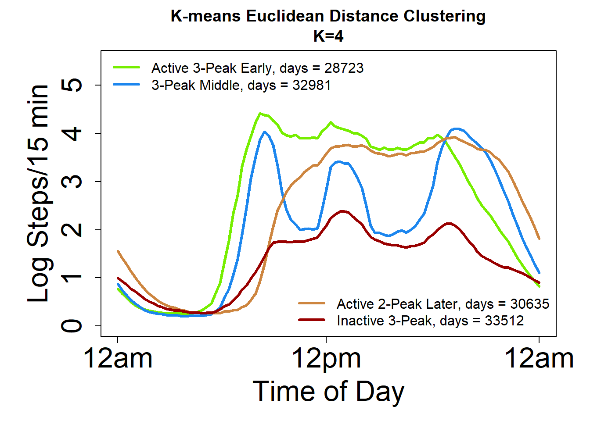
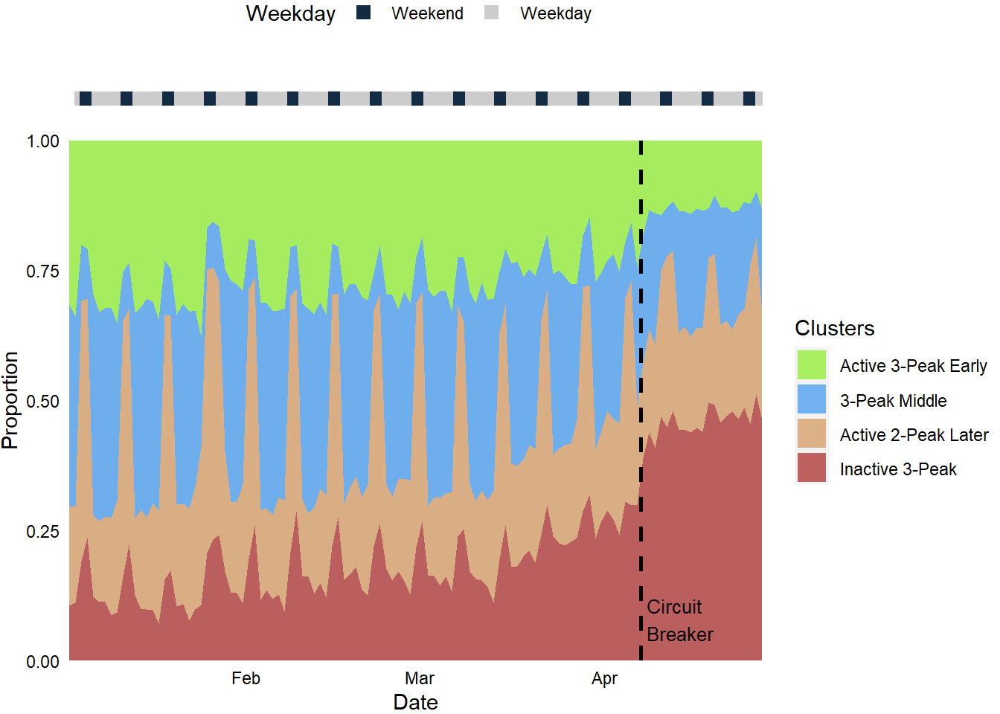

Rest Activity Rhythms During COVID19 Pandemic
================

[](https://rstudio.com/)
[](https://rmarkdown.rstudio.com/)
[](https://shields.io/)
[](https://github.com/teyang-lau/COVID19_Rest_Activity_Rhythms/blob/master/LICENSE)

Author: TeYang, Lau <br> Last Updated: 7 June 2020


### **Please refer to the research journal article [Ong, Lau, Massar et al. 2020]() published in … for the full scope and results of the project.**

## **Project Motivation**

The COVID19 pandemic has led to global panic and governments had to
issue lockdown orders to contain the spread of the virus. According to
anecdotes, this mobility restriction has massively disrupted the daily
routines of people worldwide. Behaviors such as physical activity and
sleep were reported to be affected, although no results have been
published. People have also reported more stress and anxiety due to the
pandemic. The basis of this project started from wanting to empirically
investigate how the rest activity rhythms of people were affected by
this mobility restriction. Having a dataset with access to daily
longitudinal, technologically-derived physical activity and sleep
allowed us to do this.

## **Project Goals**

1.  To **investigate** rest activity rhythm changes throughout the
    COVID19 pandemic
2.  **Cluster** days of steps counts to **identify** basis sets of rest
    activity rhythm (RAR) profiles
3.  **Identify** groups of individuals who were differentially impacted
    by COVID19
4.  **Identify** the sociodemographic composition of each group
5.  **Investigate** how each group was affected in terms of sleep and
    physical activity

## **Contents**

  - About Rest Activity Rhythms (RARs)
  - About this dataset

<!-- end list -->

1.  Data Loading
2.  Data Cleaning and Filtering
3.  Kmeans Clustering Steps <br> 3.1. Rest activity rhythm profile plots
    <br> 3.2. Individual time series RAR plots
4.  Hierarchical Clustering of Proportion of Time Spent in each Profile
    <br> 4.1. Clean and wrangle <br> 4.2. Proportion of time spent in
    each profile <br> 4.3. Hierarchical Clustering
5.  Social Demographics by Cluster <br> 5.1. Age <br> 5.2. Gender <br>
    5.3. Ethnicity <br> 5.4. Family Status <br> 5.5. Education <br> 5.6.
    Household Earnings
6.  Physical Activity and Sleep By Cluster

## **About Rest Activity Rhythms (RARs)**

Rest activity rhythms are simply the sleep-wake patterns of individuals
that usually follow a diurnal pattern, and they display rhythmicity that
is quite similar to the human endogenous circadian rhythm. They are
determined by the interaction of biological clocks, light exposure and
social factors. The timing, amplitude and regularity of RARs can
influence health and behavior, and when disrupted, can lead to increased
physical and mental morbidity.

## **About this dataset**

This data is shared by courtesy of the Singapore Health Promotion Board,
as part of the [Health Insights Singapore
(hiSG)](https://www.hpb.gov.sg/hisg) study. hiSG is a population health
study which seeks to better understand the health behaviours and
lifestyles of Singapore residents through wearable technology.
Participants were given devices (Fitbit™ Ionic, Fitbit™ Inc, San
Francisco, CA) to track their activity/sleep and installed a mobile
application to complete surveys over a period of 2 years. They were
rewarded with points convertible to vouchers if they wore the tracker
daily, logged sleep, meals, and completed surveys and were allowed to
keep the device conditional on meeting study requirements.

hiSG consisted of a few phases targeting different population. The
dataset used for this current analysis was from the first phase, which
targeted young adults working in the Singapore Central Business District
aged 21-40 years old.

Data was shared with the Sleep and Cognition Laboratory, Centre for
Sleep and Cognition, Yong Loo Lin School of Medicine, National
University of Singapore. This analysis is only a portion of the analysis
that was conducted in the Sleep and Cognition Laboratory.

# 1\. Data Loading

``` r
## Load Packages 
library(tidyverse); library(knitr); library(kableExtra); library(formattable); library(patchwork); library(zoo);
library(GGally); library(ggExtra); library(stargazer); library(car); library(factoextra); library(NbClust);
library(ggplot2); library(scales); library(ggforce); library(ggpubr); library(gmodels); library(vcd); 
library(rstatix); library(ez); library(dendextend); library(hrbrthemes); library(emmeans); library(psych)


## Load Data
steps <- read.csv('./Data/steps_wide_cleaned_JANtoAPR2020_allsubjs_validdays.csv', header = TRUE)
L2 <- read.csv('./Data/Euclideank4k5.csv', header = F) %>%
  rename('cluster_k4_L2' = 'V1', 'cluster_k5_L2' = 'V2') %>% select(cluster_k4_L2)

# Reorder cluster assignments so that clusters are in ascending order in N size
L2$cluster_k4_L2 <- match(L2$cluster_k4_L2, names(sort(table(L2$cluster_k4_L2))))
L2$cluster_k4_L2 <- match(L2$cluster_k4_L2, names(sort(table(L2$cluster_k4_L2))))
L2$cluster_k4_L2 <- match(L2$cluster_k4_L2, c(1,3,2,4)) # swap 3 and 2 so that 2 is middle and 3 is later group

## Rename columns
tod_15min <- as.character(read.table("./Data/tod_15min.txt")[,1]) # load text file with 24hr time in 15min intervals
names(steps)[3:98] <-c(tod_15min)

head(steps[,2:24])
##         Date 00:00 00:15 00:30 00:45 01:00 01:15 01:30 01:45 02:00 02:15 02:30
## 1 2020-01-07     0     0     0     0     0     0     0     0     0     0     0
## 2 2020-01-16     0     0     0     0    17     0     0     0     0     0     0
## 3 2020-01-18     0     0     0     0     0    19     0     0     0     0     6
## 4 2020-01-25     0     0     0     0     0     0     0     0     0     0     0
## 5 2020-02-20     0     0     0     0     0     0     0     0     0     0     0
## 6 2020-03-13     0     0     0     0     0     0     0     0     0     0     0
##   02:45 03:00 03:15 03:30 03:45 04:00 04:15 04:30 04:45 05:00 05:15
## 1     0     0     0     0     0     0     0     0     0     0     0
## 2     0     0     0     0     0     0     0     0     0     0     0
## 3     0     0     0     0     0     0     0    11     0     0     0
## 4     0     0     0     0     0     0     0     0     0     0     0
## 5     0     0     0     0     0     0     0     0     0     0     0
## 6     0     0     0     0     0     0     0     0     0     0     0
```

Each row refers to each day of a single participant. The 6 rows
presented belongs to the same individual. The first columns contains the
ID, which is not shown here. The rest of the columns display the Date
followed by the 96 15-min interval step counts, starting from 00:00 and
ending at 23:45.

<br>

# 2\. Data Cleaning and Filtering

As Fitbit data is noisy and contains days where participants do not wear
the watch or wear it for only a short period of time, we had to clean
and filter them prior to modelling. Briefly, we removed days with
extremely high steps counts, days with very low weartime, and days with
no resting heart rate. Below is a list of criteria used to remove days
that were deemed to be atypical or a non-wear day.

<font size="4"> \* Filter out days:

    + Total Steps > 50000 
    + Total Steps > 40000 & Sedentary Minutes > 1320 min
    + Sedentary Minutes == 1440 min
    + No Resting Heart Rate
    + WearTime < 780 min

</font>

Having missing data also means that some participants did not have
sufficient data throughout the period of interest. These participants
were removed based on a selected required proportion of days throughout
the period. For the analysis presented here, data was limited to 1
January 2020 to 27 April 2020 to evaluate the impact of the COVID-19
pandemic. We were left with 125,851 days from 1,851 participants that
were then fed into a k-means clustering model.

# 3\. Kmeans Clustering Steps

We used **K-means++** to cluster the daily intraday logged step counts.
This algorithm helps to optimize the initialization of the cluster
centres by randomly selecting the first cluster centre, and subsequently
choosing additional cluster centres from the remaaining data points with
probability proportional to their squared distance from the nearest
existing cluster centres. Simply put, it tries to separate the initiajl
cluster centres as far as possible instead of just randomly choosing
them in the case of traditional k-means. This speeds up convergence to
optimum. For the number of k, we decided on a k=4 cluster cutoff for a
parsimonious yet meaningful set of clusters. The distance metric used
was euclidean distance.

K-means clustering was done on MATLAB as it allows parallel computing
but not R. Thus, the code is not shown here. <br>

``` r
## Log Steps
# log steps and replace -Inf with 0
steps_log <- log(steps[-1:-2]) %>% anchors::replace.value(., c(1:96), from=-Inf, to=0) %>% 
  mutate(DRID = steps$DRID, Date = steps$Date) %>% select(DRID,Date,everything())

steps_log <- cbind(steps_log, L2) %>% mutate(cluster_k4_L2=factor(cluster_k4_L2))
```

<br>

## 3.1. Rest activity rhythm profile plots

We named the 4 clusters/profiles based on their RAR profile magnitude,
phase, and shape:

1.  Active 3-Peak Early
2.  3-Peak Middle
3.  Active 2-Peak Later
4.  Inactive 3-Peak

<!-- end list -->

``` r
# Euclidean cluster aggregate
steps_agg_log_k4_L2 <- aggregate(steps_log[, 3:98],
                           by = list(steps_log$cluster_k4_L2),
                           FUN = mean)

## Plot Cluster Profiles
#### Euclidean Distance 

color4 <- c("chartreuse2","dodgerblue2",'tan3',"#990000")

par(mar=c(5,6,3,2))
plot(0,0,xlim = c(0,95),ylim = c(0,5.5),type = "n", xlab='Time of Day', ylab='Log Steps/15 min', xaxt="n", yaxt='n', cex.lab=2) # create empty plot for line graphs
axis(1, at=c(0,47,95),labels=c('12am', '12pm', '12am'),cex.axis=2, tck=-0.02)
for (i in 1:4){
  lines(c(0:95),steps_agg_log_k4_L2[i,-1], col = color4[steps_agg_log_k4_L2$Group.1[i]], lwd = 3)
}
title(main="K-means Euclidean Distance Clustering\nK=4")
legend("topleft", legend=c(paste('Active 3-Peak Early, days =',as.character(table(steps_log$cluster_k4_L2)[1]),sep=' '),
                           paste('3-Peak Middle, days =',as.character(table(steps_log$cluster_k4_L2)[2]),sep=' ')),
       col=color4, lty=1, lwd=3, cex=1, bty='n')
legend("bottomright", legend=c(paste('Active 2-Peak Later, days =',as.character(table(steps_log$cluster_k4_L2)[3]),sep=' '),
                           paste('Inactive 3-Peak, days =',as.character(table(steps_log$cluster_k4_L2)[4]),sep=' ')),
       col=color4[3:4], lty=1, lwd=3, cex=1, bty='n')
axis(2, cex.axis=2, tck=-0.02)
```



## 3.2. Individual time series RAR plots

Here, we looked at the time series RAR throughout the COVID19 period for
3 participants.

``` r
# Get some samples for plotting
samp <- c("439CD3EEBF37", "13F9D36BC9AC", "63A98BD38B70")
# "CCC8BC39C073" "B7891B5C3B02" "D0C79BF6A82A" "439CD3EEBF37" "13F9D36BC9AC" "63A98BD38B70"
sampledf <-  data.frame()
for(i in 1:length(samp)) {
  id <- samp[i]
  subjnum <- which(as.character(unique(steps_log$DRID)) %in% id)
  indiv_steps <- filter(steps_log, DRID==id) %>% arrange(Date)
  indiv_steps_long <- gather(indiv_steps, Time, Steps, 3:98) %>% arrange(Date,Time) %>% mutate(DateTime = as.POSIXct(paste(Date,Time)))
  indiv_steps_long <- indiv_steps_long %>% mutate(index=rep(subjnum, dim(indiv_steps_long)[1]))
  sampledf <- rbind(sampledf, indiv_steps_long)
}

# Plot
par(mar=c(5,6,3,6))
p <- ggplot(sampledf, aes(DateTime, Steps, color=cluster_k4_L2)) + geom_path(aes(group=1)) +
          theme_classic() +
          ylab('Log Steps/15 min') +
          #scale_fill_manual(name = "Cluster", breaks = c("Delayed", "Most Active", "Least Active")) +
          scale_colour_manual('Profiles',values=color4, breaks=c("1", "2", "3", "4"), labels=c("Active 3-Peak Early", "3-Peak Middle", "Active 2-Peak Later", "Inactive 3-Peak"),
        guide=guide_legend(keywidth=3, override.aes = list(size = 2)),                              ) +
          scale_x_datetime(labels=date_format('%d %b', tz='Singapore'), date_breaks = '7 days', expand=c(0,0.9)) +
          theme(axis.text.x=element_text(angle=45, hjust=1, size=10), legend.key.size = unit(1, "cm"),legend.title = element_text('Profiles', size=15, face="bold"), 
        legend.text = element_text(size=15), axis.text.y = element_text(size=15), axis.title=element_text(size=15), 
        plot.title = element_text(hjust = 0.5)) + 
  geom_vline(xintercept=as.numeric(as.POSIXct(c('2020-03-26','2020-04-7'))), linetype='dashed', lwd=1, color = "black")

p + facet_grid(rows=vars(index))
```

 <br>

The plots are color-coded with the 4 profile states. The 2 dotted black
lines indicate the pubs closure and start of circuit breaker in
Singapore respectively. Participant 144 was clearly affected by the pubs
closure and circuit breaker, as their RARs shifted from primarily brown
(Active 2-Peak Later) to red (Inactive 3-Peak) slightly before the start
of circuit breaker. Participant 709 was less affected, and you can see
clear weekday-weekend differences for the last 2/3 of the time series.

<br>

# 4\. Hierarchical Clustering of Proportion of Time Spent in each Profile

Having identified 4 sets of daily RAR profiles, we computed for each
participant, the proportion of time spent in each RAR profile, for both
before the circuit breaker (Pre-CB), and during the circuit breaker
(CB). These proportions represents the composition of and change in RAR
profiles throughour the COVID19 period for each individual. The purpose
here is to identify groups whose RARs were distinctly affected by the
pandemic.

## 4.1. Clean and wrangle

Here, we further filtered the participants such that those eligible are
required to have at least 60% of valid days both pre-circuit breaker and
during circuit breaker. We then wrangle the data to long format for
plotting and further analysis.

``` r
# Fill in missing days
uniqueID = unique(steps_log$DRID)
DRID = rep(uniqueID, each = 118)
Date = rep(seq(as.Date('2020-01-01'),as.Date('2020-04-27'), by='1 day'), times = length(unique(steps_log$DRID)))
fulldays = data.frame(DRID, Date) # create dataframe with full 118 days since day start for each ID

steps_period <- steps_log %>% select(DRID,Date,cluster_k4_L2) %>% 
                           mutate(Date = as.Date(as.character(Date))) %>% filter(Date <= '2020-04-27')
alldaysteps <- full_join(fulldays, steps_period)

# Filter Ps with enough days
preeligible <- steps_log %>% mutate(Date=as.Date(as.character(Date))) %>% filter(Date < '2020-04-07') %>% group_by(DRID) %>% summarise(predays = n()) %>% 
  filter(predays >= 59) %>% as.data.frame() # 59/97 days for pre-cb 60%
posteligible <- steps_log %>% mutate(Date=as.Date(as.character(Date))) %>% filter(Date >= '2020-04-07' & Date <= '2020-04-27') %>%
  group_by(DRID) %>% summarise(postdays = n()) %>% filter(postdays >= 13) %>% as.data.frame() # 13/21 days for pre-cb
eligible <- merge(preeligible, posteligible) 
#eligible <- filter(eligible, !DRID %in% c('A4596E5A98F6', 'F2D312B33D63'))

alldaysteps <- filter(alldaysteps, DRID %in% eligible$DRID)

long <- alldaysteps %>% mutate(Date = as.POSIXct(Date, format='%Y-%m-%d', tz='Singapore'))

events <- data.frame(n=c('First\nCase','Chinese\nNew Year','Health Alert\nLevel Raised','WHO Pandemic','Malaysia\nBorder Closure','Pubs Closure*', 'Circuit Breaker'), Date=as.POSIXct(c('2020-01-21','2020-01-27','2020-02-08','2020-03-08','2020-03-17','2020-03-26','2020-04-7')))
```

<br>

## 4.2. Proportion of time spent in each profile

We then proceeded to compute the proportion of time each individual
spend in each state pre-circuit breaker and during circuit breaker. Each
row of the dataframe refers to 1 individual. The first column contains
the ID and is not shown here.

``` r
# Proportion of time spent in each state Pre-Circuit Breaker
precb <- long %>% filter(Date <'2020-04-07') %>% filter(!is.na(cluster_k4_L2)) %>% group_by(DRID) %>% 
  mutate(ndays=n()) %>% as.data.frame() %>% # get total days for each subject with no NAs
  group_by(DRID,cluster_k4_L2) %>% 
  summarize(proportion=n()/ndays[1]) %>% as.data.frame() %>%
  spread(., cluster_k4_L2, proportion) 
precb[is.na(precb)] <- 0
names(precb)[2:5] <-c("Pre-CB Active 3-Peak Early", "Pre-CB 3-Peak Middle",'Pre-CB Active 2-Peak Later', "Pre-CB Inactive 3-Peak")

# Proportion of time spent in each profile During Circuit Breaker
duringcb <- long %>% filter(Date >= '2020-04-07') %>% filter(!is.na(cluster_k4_L2)) %>% group_by(DRID) %>% 
  mutate(ndays=n()) %>% as.data.frame() %>% # get total days for each subject with no NAs
  group_by(DRID,cluster_k4_L2) %>% 
  summarize(proportion=n()/ndays[1]) %>% as.data.frame() %>%
  spread(., cluster_k4_L2, proportion)
duringcb[is.na(duringcb)] <- 0
names(duringcb)[2:5] <-c("CB Active 3-Peak Early",  "CB 3-Peak Middle", 'CB Active 2-Peak Later', "CB Inactive 3-Peak")

preduringcb_k4_L2 <- merge(precb,duringcb,by='DRID')
preduringcb_k4_L2 <- preduringcb_k4_L2[,c(1,2,6,3,7,4,8,5,9)]

#z-score features
# preduringcb_k4_L2 <- preduringcb_k4_L2 %>% select(-DRID) %>% scale(.) %>% as.data.frame() %>% 
#   mutate(DRID = precb$DRID) %>% select(DRID, everything())

head(preduringcb_k4_L2[,2:9])
##   Pre-CB Active 3-Peak Early CB Active 3-Peak Early Pre-CB 3-Peak Middle
## 1                 0.37234043             0.00000000            0.1063830
## 2                 0.28947368             0.07692308            0.5131579
## 3                 0.07368421             0.00000000            0.5473684
## 4                 0.29032258             0.07142857            0.5913978
## 5                 0.12658228             0.00000000            0.2784810
## 6                 0.54639175             0.20000000            0.1958763
##   CB 3-Peak Middle Pre-CB Active 2-Peak Later CB Active 2-Peak Later
## 1        0.0000000                 0.17021277              0.0000000
## 2        0.3076923                 0.14473684              0.4615385
## 3        0.2380952                 0.28421053              0.0952381
## 4        0.6428571                 0.03225806              0.2142857
## 5        0.0625000                 0.26582278              0.0000000
## 6        0.2000000                 0.20618557              0.3500000
##   Pre-CB Inactive 3-Peak CB Inactive 3-Peak
## 1             0.35106383         1.00000000
## 2             0.05263158         0.15384615
## 3             0.09473684         0.66666667
## 4             0.08602151         0.07142857
## 5             0.32911392         0.93750000
## 6             0.05154639         0.25000000
```

<br>

### Propotion of each profile state throughout COVID19

``` r
## Stacked Area Chart of Proportion Spent in Each State
stacked <- long %>% filter(!is.na(cluster_k4_L2)) %>% filter(Date >= '2020-01-02') %>% group_by(Date, cluster_k4_L2) %>% 
  summarise(n = n()) %>% mutate(Proportion=n/sum(n))
stackprop <- ggplot(stacked, aes(x=Date, y=Proportion, fill=factor(cluster_k4_L2))) + 
  geom_area(alpha=0.6 , size=1) +
  scale_x_datetime(expand = c(0, 0)) +
  scale_y_continuous(expand = c(0, 0)) +
  scale_fill_manual(values = c("chartreuse2","dodgerblue2",'tan3',"#990000"),na.value = "gray30", name='Clusters', labels=c("Active 3-Peak Early", "3-Peak Middle","Active 2-Peak Later", 'Inactive 3-Peak')) +
  theme(axis.line=element_blank(), panel.grid.major = element_blank(), panel.grid.minor = element_blank(), 
        axis.ticks = element_blank(), axis.text=element_text(color='black')) +
  geom_vline(xintercept=as.numeric(as.POSIXct(c('2020-04-7'))), linetype='dashed', lwd=1, color = "black") + 
  annotation_custom(
      grob = grid::textGrob(label = 'Circuit\nBreaker', hjust = 0, gp = grid::gpar(cex = 0.8)),
      ymin = 0.08,      # Vertical position of the textGrob
      ymax = 0.08,
      xmin = events$Date[7] + 86400,         # Note: The grobs are positioned outside the plot area
      xmax = events$Date[7] + 86400) 
  
# Top Event Bar
g2 <- data.frame(Date) %>% filter(Date != '2020-01-01') %>%  # remove 1 Jan
  mutate(Weekday = factor(as.numeric(timeDate::isWeekday(Date))), Date=as.POSIXct(Date, format='%Y-%m-%d', tz='Singapore'))
topbar2 <- ggplot(g2, aes(y = 0, x = Date)) + geom_point(aes(color = Weekday), shape = 15, size = 3, show.legend = T) + 
    scale_color_manual(values = c('#132B43', '#cccccc'), labels=c('Weekend','Weekday')) + # WE is 0, WD is 1
    theme_classic() + 
    theme(axis.title = element_blank(), axis.line = element_blank(), 
          axis.text = element_blank(), axis.ticks = element_blank(),
          plot.margin = unit(c(0,0,0,0), "lines"),
          legend.position = 'top') +
          scale_x_datetime(expand=c(0,0.9)) 

par(mar=c(1,1,1,1))
stackprop + annotation_custom(ggplotGrob(topbar2), ymin = 1.3) + coord_cartesian(clip = "off") + 
  theme(plot.margin=unit(c(2.5,0,0,0),"cm"))
```

 <br>

The stacked chart shows the proportion of each state throughout the
COVID19 period. The weekday-weekend changes in RAR profiles can clearly
be seen, although this difference was attenuated during circuit breaker.
There was also an increase in less active RAR profiles and decrease in
more active RAR profiles during circuit breaker.

<br>

## 4.3. Hierarchical Clustering

Next, we clustered these proportions using hierarchical clustering to
identify groups of participants whose RAR compositions were
differentially affected by COVID19.

### Dendrogram and heatmap

4 clusters were chosen based on the most appropriate place to cut the
dendrogram.

``` r
# hierarchical clustering
res.dist <- dist(preduringcb_k4_L2[-1], method = "euclidean")
res.hc <- hclust(d = res.dist, method = "ward.D2")

# customize dendrogram
dend <- as.dendrogram(res.hc)
# Color the branches based on the clusters:
dend <- color_branches(dend, col=c("#990000","chartreuse2","dodgerblue2",'tan3'), k=4) 
plot_horiz.dendrogram(dend, side = F)
```


``` r
grp <- c(1:670)
dendClus <- dendextend:::cutree(res.hc, k=4, order_clusters_as_data = FALSE) # order of dendrogram
ord <- order.dendrogram(dend) # index of original dataframe corresponding to cluster assignment in dendClus
grp[ord] = dendClus
```

``` r
# assign clustering group
preduringcb_k4_L2 <- preduringcb_k4_L2 %>% mutate(cluster=grp)

ppcb_long_k4_L2 <- merge(long,preduringcb_k4_L2 %>% select(DRID,cluster), by='DRID') %>%
  mutate(DRID=as.factor(as.character(DRID))) %>% arrange(cluster,DRID,Date)
ppcb_long_k4_L2 <- ppcb_long_k4_L2 %>% mutate(idx=as.factor(rep(c(1:670),each = 118)))


dend <- dend %>% rotate(670:1) # rev dendrogram for plotting
## Heatmap with Dendrogram of Hierarchical Clustering
par(mar=c(10,6,4,2))
gplots::heatmap.2(as.matrix(preduringcb_k4_L2 %>% select(-DRID,-cluster)), 
          #main = "Heatmap for the Iris data set",
          srtCol = 20,
          dendrogram = "row",
          Rowv = dend,
          Colv = "NA", # this to make sure the columns are not ordered
          trace="none",
          labRow = F,
          cexRow = 0.1,
          margins =c(7,7),      
          key.xlab = "Proportion",
          denscol = "grey",
          density.info = "none",
          col=RColorBrewer::brewer.pal(9,"Blues")[2:6]
          )
```

 <br>

The heatmap shows the result of the hierarchical clustering. Each row
belongs to 1 participant. Differences in RAR composition can clearly be
seen between clusters. For example, the red cluster of participants
shows a higher proportion of Inactive 3-Peak profiles during CB but not
other profiles, while the green cluster shows consistently high
proportions of 3-Peak Early both pre-CB and post-CB.

<br><br><br>

### Heatmap of individual RAR time series grouped by cluster

Having clustered participants into different groups according to their
RAR composition, we plotted their RAR time series profiles throughout
the whole period as a heatmap.

``` r
k4_L2_cluster_hm <- ggplot(ppcb_long_k4_L2,aes(x=Date,y=rev(idx),fill=cluster_k4_L2))+
  geom_tile() +
  labs(y="") +
  #ggtitle('Heatmap of 15min Interval Steps by Each Individual') +
  scale_x_datetime(labels=scales::date_format('%d %b',tz='Singapore'), date_breaks = '7 day', expand=c(0,0.9)) +
  scale_fill_manual(values = c("chartreuse2","dodgerblue2",'tan3',"#990000"),na.value = "gray30", name='Profiles', 
                    labels=c("Active 3-Peak Early", "3-Peak Middle","Active 2-Peak Later", 'Inactive 3-Peak', "Missing Days")) +
  theme(axis.text.y = element_blank(), axis.ticks = element_line(size=0.3), axis.text.x=element_text(angle=45, hjust=1), plot.margin = unit(c(6,1,1,1), "lines")) + 
  geom_vline(xintercept=as.numeric(as.POSIXct(c('2020-01-25','2020-01-28', '2020-03-12', '2020-03-16', '2020-03-26'))), linetype='dashed', lwd=1, color = "black") +
  geom_vline(xintercept=as.numeric(as.POSIXct(c('2020-01-23'))), linetype='dashed', lwd=1, color = "black") + 
  geom_vline(xintercept=as.numeric(as.POSIXct(c('2020-02-7'))), linetype='dashed', lwd=1, color = "black") +
  geom_vline(xintercept=as.numeric(as.POSIXct(c('2020-04-7'))), linetype='dashed', lwd=1, color = "black") +
  coord_cartesian(clip = 'off') # prevents text from clipping off 

for (i in 1:length(events$n))  {
  k4_L2_cluster_hm <- k4_L2_cluster_hm + annotation_custom(
      grob = grid::textGrob(label = events$n[i], hjust = 0, rot=45, gp = grid::gpar(cex = 0.7)),
      ymin = 751,      # Vertical position of the textGrob
      ymax = 751,
      xmin = events$Date[i],         # Note: The grobs are positioned outside the plot area
      xmax = events$Date[i])
}

# Top Event Bar
g <- data.frame(Date) %>% mutate(Weekday = as.factor(as.numeric(timeDate::isWeekday(Date))), Date=as.POSIXct(Date, format='%Y-%m-%d', tz='Singapore'))
topbar <- ggplot(g, aes(y = 0, x = Date)) + geom_point(aes(color = Weekday), shape = 15, size = 3, show.legend = F) + 
    #scale_color_manual(values = c('#00BA38', '#619CFF', '#F8766D')) +
    theme_classic() + 
    scale_color_manual(values = c('#132B43', '#cccccc'), labels=c('Weekend','Weekday')) + # WE is 0, WD is 1
    theme(axis.title = element_blank(), axis.line = element_blank(), 
          axis.text = element_blank(), axis.ticks = element_blank(),
          plot.margin = unit(c(0,0,0,0), "lines")) +
          scale_x_datetime(expand=c(0,0.9))

par(mar=c(2.5,1,1,1))
hm <- k4_L2_cluster_hm + annotation_custom(ggplotGrob(topbar), ymin = 725)
```

 <br> Again, each row represents 1
individual. We can clearly see the weekday-weekend distinction, with
weekdays consisting of mostly brown delayed active days (Active 2-Peak
Later). More importantly and strikingly, the 4 groups showed very
distinct patterns, indicating the differential impact of COVID19 on
them. We can see that Group 1, which made up about 50% of the entire
sample, was greatly affected, becoming less active during CB, while
Group 2 remained consistently active.

This heatmap also shows that the pandemic per se did not alter the
rest-activity rhythms of individuals that much, but it was the mobility
restriction (circuit breaker/lockdown) imposed by the government that
led to the changes.

<br>

# 5\. Social Demographics by Group

We then proceeded to look at how the 4 groups differed in terms of
sociodemographics. One-way ANOVAs followed by post-hoc tests were used
for age while Chi-Square Test of Independence were used for all other
categorical variables. Mosaic plots were used to show the chi-square
tests results. It compares each cell’s expected frequency with its
observed frequency. If the cell is shaded blue, it means it has a
significantly higher observed than expected frequency. If the cell is
shaded red, it means a lower observed than expected frequency.

## 5.1. Age

``` r
sociodemo <- read.csv('C:/Users/TeYan/OneDrive/Work/Github/COVID19_RAR/Data/sociodemo.csv', header = TRUE) %>%
  mutate(cluster=factor(cluster))

# Violin Plot
plot_violin <- function(df, summ, y, ymin, ymax, p_pos_y, title, j_size=0.6, p_size=2.5, p_pos_x=1,method='anova') {
  y.var <- enquo(y)
  ggplot(data = df, aes(x = cluster, y = !! y.var)) + 
  geom_sina(aes(color = cluster), alpha = 0.3, cex = j_size) +
  geom_violin(aes(fill = cluster), color='white', alpha = 0.5, draw_quantiles = c(0.25, 0.5, 0.75), trim = F, width = 0.6) +
  scale_color_manual(values = c('#990000','chartreuse2','dodgerblue2','tan3')) +
  scale_fill_manual(values = c('#990000','chartreuse2','dodgerblue2','tan3')) +
  guides(fill=guide_legend(title='Clusters')) +
  xlab('') +
  labs(title = title, color='black') +
  theme_classic() +
  #stat_compare_means(label.y = p_pos_y, label.x = p_pos_x, method=method, size = p_size) +
  geom_point(aes(y = mean), color = "black", size = 0.1, data = summ) + # errorbar dot
  geom_errorbar(aes(y = mean, ymin = mean-se, ymax = mean+se), # errorbar bar
                color = "black", width = 0.2, size=0.3, data = summ) +
  scale_y_continuous(expand = c(0, 0), limits = c(ymin,ymax)) +
  theme(legend.position='none', axis.title = element_text(color='black'), axis.text = element_text(color='black')) 
}

#### Analyses

#k4_L1
#Age
#age_aov <- aov(Age~cluster, data=sociodemo)
#summary(age_aov)
#TukeyHSD(age_aov)
#pairwise.t.test(sociodemo$Age, sociodemo$cluster, p.adjust.method = "none")

ageSE <- sociodemo %>% group_by(cluster) %>% summarise(mean = mean(Age), se = sqrt(var(Age)/length(Age)))
my_comparisons <- list(c(1,2),c(1,4))
plot_violin(sociodemo, ageSE, Age, 10, 50, 48, '', j_size=1) + 
  stat_compare_means(comparisons = my_comparisons, method = 't.test', label = "p.signif", label.y=c(48,46,44)) + ylab('Age')
```

 <br>

Group 1 is on average, \~1.5-2 years younger than Group 2, 3 and 4,
although the Group 1 & 3 posthoc pairwise comparison did not reach
significance (*p* = .05)

## 5.2. Gender

``` r
# Gender
mosaic(~ cluster+Gender, data = sociodemo
      , gp = shading_Friendly # shade = TRUE
      , main="Frequencies of Gender by Cluster"
      , labeling = labeling_values
      , value_type = "observed"
      , gp_text = gpar(fontface = 3)
      , rot_labels = c(left = 360)
      , just_labels = c(left = 'right')
      , set_labels=list(Gender = c('Female', 'Male'))
      , gp_labels=(gpar(fontsize=7)))
```


## 5.3. Ethnicity

``` r
# Ethnicity
mosaic(~ cluster+Ethnicity, data = sociodemo
      , gp = shading_Friendly # shade = TRUE
      , main="Frequencies of Ethnicity by Cluster"
      , labeling = labeling_values
      , value_type = "observed"
      , gp_text = gpar(fontface = 3)
      , rot_labels = c(top = 45)
      , just_labels = c(left = 'right')
      , gp_labels=(gpar(fontsize=7)))
```


## 5.4. Family Status

``` r
# Family Status
mosaic(~ cluster+newFamStatus, data = sociodemo
      , gp = shading_Friendly # shade = TRUE
      , main="Frequencies of Family Status by Cluster"
      , labeling = labeling_values
      , value_type = "observed"
      , gp_text = gpar(fontface = 3)
      , rot_labels = c(top = 360)
      , just_labels = c(left = 'right')
      , set_labels=list(newFamStatus = c('MNC','MWC','SDW','Single'))
      , gp_labels=(gpar(fontsize=7)))
```

 <br>

  - Group 1 has more singles and less married with children individuals
    than expected.
  - Group 2 has more married with children and less married with no
    children.
  - Group 4 has less singles and more married with children individuals
    than expected.

## 5.5. Education

``` r
# Highest Education

mosaic(~ cluster+HighestEducation, data = sociodemo
      , gp = shading_Friendly # shade = TRUE
      , main="Frequencies of Highest Education by Cluster"
      , labeling = labeling_values
      , value_type = "observed"
      , gp_text = gpar(fontface = 3)
      , rot_labels = c(left = 360)
      , just_labels = c(left = 'right')
      , set_labels=list(FamStatus = c('Degree','No Degree'))
      , gp_labels=(gpar(fontsize=7)))
```


## 5.6. Household Earnings

``` r
mosaic(~ cluster+HouseholdEarnings, data = sociodemo
      , gp = shading_Friendly # shade = TRUE
      , main="Frequencies of Household Earnings by Cluster"
      , labeling = labeling_values
      , value_type = "observed"
      , gp_text = gpar(fontface = 3)
      , rot_labels = c(left = 360)
      , just_labels = c(left = 'right')
      , gp_labels=(gpar(fontsize=7)))
```


# 6\. Physical Activity and Sleep By Cluster

We also investigated how each group differ in terms of their physical
activity and sleep between pre-CB and during CB. Mixed ANOVAs were used
and when significant, post-hoc pairwise comparisons were used.

``` r

# Load Sleep Data
sleep <- read.csv('./Data/Sleep_timeseries2020.csv', header=T)
sleep <- sleep %>% mutate(MORNINGDATE = as.POSIXct((MORNINGDATE - 719529)*86400, origin = "1970-01-01", tz = "UTC")) # convert matlab datenum to r date

eligible <- read.csv('./Data/eligible_670.csv', header = TRUE)
sleep <- merge(eligible,sleep) %>% rename('Date' = 'MORNINGDATE') %>% arrange(DRID, Date)


# Filter Sleep, Criteria: 5 WD 2 WE for pre and during
pre_sleep <- filter(sleep, Date <= as.Date('2020-01-22')) %>% mutate(preduring = 1)
preeligible <- pre_sleep %>% group_by(DRID) %>% mutate(nwd=sum(MORNINGDAY %in% c(2,3,4,5,6)), nwe=sum(MORNINGDAY %in% c(7,1))) %>%
  as.data.frame() %>% filter(nwd >= 5, nwe >= 2)
during_sleep <- filter(sleep, Date >= as.Date('2020-04-7')) %>% mutate(preduring = 2)
duringeligible <- during_sleep %>% group_by(DRID) %>% mutate(nwd=sum(MORNINGDAY %in% c(2,3,4,5,6)), 
                                                             nwe=sum(MORNINGDAY %in% c(7,1))) %>%
  as.data.frame() %>% filter(nwd >= 5, nwe >= 2)
# get Ps that fulfill both pre and during cb
sleep_eligible <- merge(preeligible %>% select(DRID), duringeligible %>% select(DRID))  %>% distinct(DRID) %>% 
  merge(., preduringcb_k4_L2 %>% select(DRID,cluster))
preduring_sleep <- rbind(pre_sleep, during_sleep) %>% merge(.,sleep_eligible) %>% 
  mutate(preduring=factor(preduring,labels=c('Baseline','Lockdown'))) 
preduring_sleep <- preduring_sleep %>% select(DRID,cluster,preduring,TimeInBed,MinutesAsleep,BEDTIME,WAKETIME,SE) %>% 
  group_by(DRID, preduring) %>% summarise_all(list(mean=mean, sd=sd), na.rm=T) %>% as.data.frame() %>%
  select(-cluster_sd) %>% rename('cluster'='cluster_mean')

# Function for removing outliers based on 1.5 IQ range
remove_outliers <- function(x, na.rm = TRUE, ...) {
  qnt <- quantile(x, probs=c(.25, .75), na.rm = na.rm, ...)
  H <- 1.5 * IQR(x, na.rm = na.rm)
  y <- x
  y[x < (qnt[1] - H)] <- NA
  y[x > (qnt[2] + H)] <- NA
  y
}

# Mixed ANOVA Sleep
df_filt <- preduring_sleep  %>% mutate(cluster=factor(cluster)) %>% group_by(cluster,preduring) %>% 
  mutate(outliers_removed = remove_outliers(BEDTIME_mean)) %>% as.data.frame()
df_filt <- df_filt %>% filter(!DRID  %in% filter(df_filt, is.na(outliers_removed))$DRID) %>% 
  mutate(DRID=factor(as.character(DRID))) %>% # remove Ps with NAs
  select(DRID, outliers_removed, cluster, preduring)

res.aov <- anova_test(
  data = df_filt, dv = outliers_removed, wid = DRID,
  between = cluster, within = preduring
  )
#get_anova_table(res.aov)

# Plot  
df_filt <- preduring_sleep  %>% mutate(cluster=factor(cluster)) %>% group_by(cluster,preduring) %>% 
  mutate(outliers_removed = remove_outliers(BEDTIME_mean)) %>% as.data.frame()
df_filt <- df_filt %>% filter(!DRID  %in% filter(df_filt, is.na(outliers_removed))$DRID) %>% 
  mutate(DRID=factor(as.character(DRID))) %>% # remove Ps with NAs
  select(DRID, outliers_removed, cluster, preduring)  
bt <- ggplot(df_filt, aes(x=cluster, y=outliers_removed), ylab = 'Bedtime (hh:mm)') + 
  geom_boxplot(aes(fill=preduring), position=position_dodge(0.9)) + 
  xlab('Group') + ylab('Bedtime (hh:mm)\n') +
  theme_classic() + 
  scale_y_time(name='Bed Time (hh:mm)',expand = c(0, 0), limits=c(-150,250), breaks=c(-120,0,120,240),
               labels=c('22:00','00:00','02:00','04:00')) +
  theme(axis.text = element_text(size=15, color='black'), axis.title = element_text(size=15, color='black'), legend.position='none') +
  scale_fill_manual(values=c('#00BFC4','#F8766D')) +
  stat_summary(fun=mean, geom="point", aes(group=preduring), position=position_dodge(0.9), 
               color="black", size=2) 
```


<br>

Not surprisingly, Group 1 and Group 4 both has later bedtimes during CB
than before CB. All 4 groups also had later wake up times, as most
people can work from home. In terms of time in bed and total sleep time,
most groups slept more during the CB, which was not consistent with
anecdotes suggesting that sleep might be affected. In fact, sleep
improved.

In terms of physical activity, all groups experienced reduce total steps
due to the mobility restriction and only Group 3 did not have reduced
MVPA, which is stands for moderate to vigorous physical activity.

Lastly, resting heart rate drop by about 2 bpm. Lower resting heart rate
is usually a associated with better health. This reduction might be due
to a couple of reasons such as not needing to go to work and increased
sleep time. All in all, the circuit breaker seems to only affect
physical activity negatively, with bed time and wake time delayed.

# 7\. Conclusions

Longitudinal monitoring of rest activity rhythms through the COVID19
period which was governed by mobility restrictions revealed heterogenous
patterns of sleep and physical activity. This provides an opportunity to
identify persons or groups at risk and administer interventions should
further lockdowns occur. During the circuit breaker, there was on
average, a 38% decrease in total steps, which was way higher than the
gain in a previous physical activity intervention program that aimed to
incentivize people to exercise. As lower physical activity is linked to
obesity and increases the risk of cardiovascular diseases, interventions
should be taken to address the extremely high reduction in steps for
long periods of time, especially when people are not allowed to leave
their houses. Finally, the impact of a longer lockdown would surely have
more drastic consequences and should be studied should it be extended
due to the pandemic.
