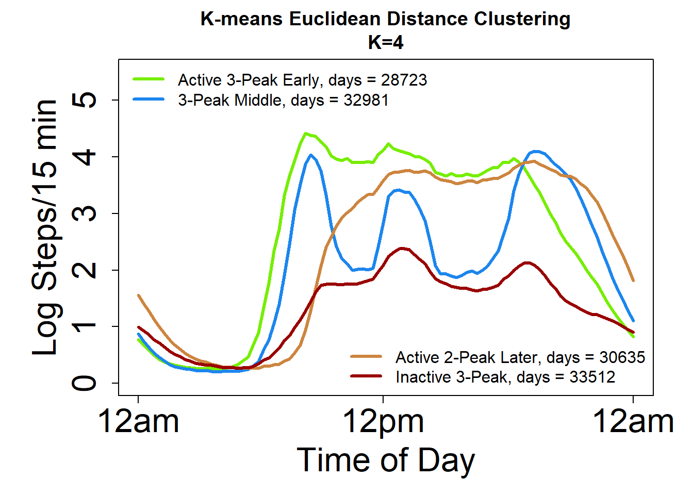
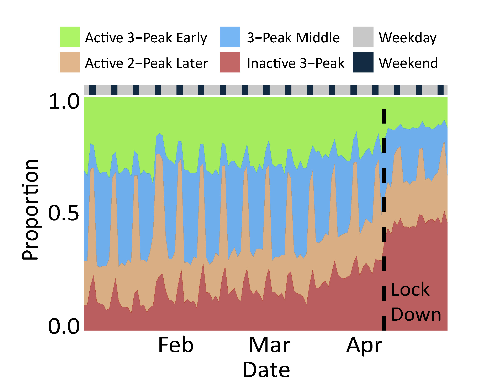
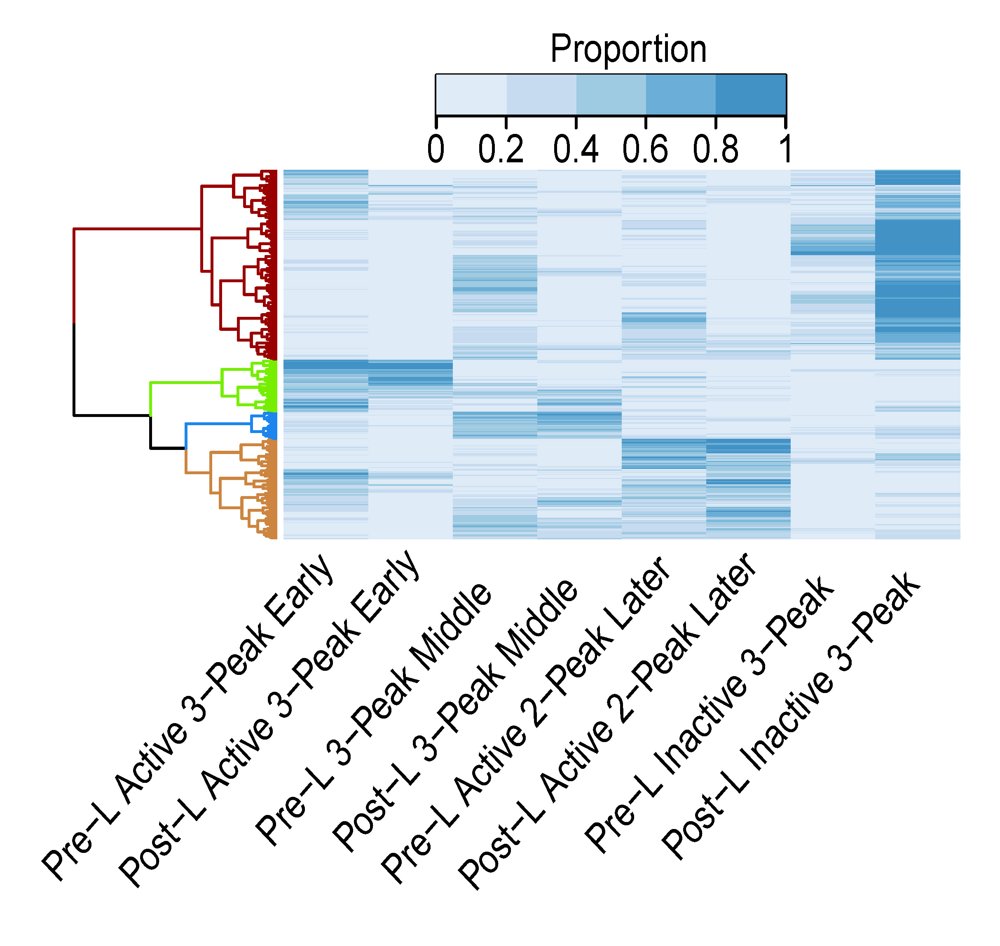

# Rest Activity Rhythms During COVID19 Pandemic

Author: TeYang, Lau  
Last Updated: 6 June 2020

 

### **Please refer to this [document](https://github.com/teyang-lau/COVID19_Rest_Activity_Rhythms/blob/master/COVID19_Cluster_Analysis.md) for a more detailed description, analysis and insights of the project.** 
### **Alternatively, refer to the research journal article [Ong, Lau, Massar et al. COVID-19 Related Mobility Reduction: Heterogenous Effects on Sleep and Physical Activity Rhythms. 2020](https://academic.oup.com/sleep/advance-article/doi/10.1093/sleep/zsaa179/5904453) published in SLEEP for the full scope and results of the project.**

## **Project Goals** ##
1. To **investigate** rest activity rhythm changes throughout the COVID19 pandemic
2. **Cluster** days of steps counts to **identify** basis sets of rest activity rhythm (RAR) profiles
3. **Identify** groups of individuals who were differentially impacted by COVID19
4. **Identify** the sociodemographic composition of each group
5. **Investigate** how each group was affected in terms of sleep and physical activity 

## **Project Overview** ##
* Cleaning Fitbit data and filtering out abnormal days
* K-means++ clustering of 120,000+ days of intraday steps to identify sets of RAR profiles
* Computed proportion of time spent in each RAR profile per individual
* Hierarchical clustering of these proportions to identify groups of individuals differentially impacted by COVID19
* Performed Chi-Square Tests to look at sociodemographics in each group
* Performed Mixed ANOVAS to look at sleep and physical activity changes from before Circuit Breaker to during Circuit Breaker for each each group

## **About Rest Activity Rhythms (RARs)** 
Rest activity rhythms are simply the rest and physical activity patterns of individuals, and they display rhythmicity that is quite similar to the human circadian rhythm. They are determined by the interaction of biological clocks, light exposure and social factors. The timing, amplitude and regularity of RARs can influence health and behavior, and when disrupted, can lead to increased physical and mental morbidity.

## **About this dataset** ##
This data is shared by courtesy of the Singapore Health Promotion Board, as part of the [Health Insights Singapore (hiSG\)](https://www.hpb.gov.sg/hisg) study. hiSG is a population health study which seeks to better understand the health behaviours and lifestyles of Singapore residents through wearable technology. Participants were given devices (Fitbit™ Ionic, Fitbit™ Inc, San Francisco, CA) to track their activity/sleep and installed a mobile application to complete surveys over a period of 2 years. They were rewarded with points convertible to vouchers if they wore the tracker daily, logged sleep, meals, and completed surveys and were allowed to keep the device conditional on meeting study requirements.

hiSG consisted of a few phases targeting different population. The dataset used for this current analysis was from the first phase, which targeted young adults working in the Singapore Central Business District aged 21-40 years old.

Data was shared with the Sleep and Cognition Laboratory, Centre for Sleep and Cognition, Yong Loo Lin School of Medicine, National University of Singapore. This analysis is only a portion of the analysis that was conducted in the Sleep and Cognition Laboratory.

## **Data Cleaning and Filtering** 
As Fitbit data is noisy and contains days where participants do not wear the watch or wear it for only a short period of time, we had to clean and filter them prior to modelling. Briefly, we removed days with extremely high steps counts, days with very low weartime, and days with no resting heart rate. Refer to the main document to see more specifics about the cleaning process. 

Having missing data also means that some participants did not have sufficient data throughout the period of interest. These participants were removed based on a selected required proportion of days throughout the period. For the analysis presented here, data was limited to 1 January 2020 to 27 April 2020 to evaluate the impact of the COVID-19 pandemic.

## **Clustering Daily Steps** 
We used **K-means++** to cluster the 120,000+ daily intraday logged step counts and decided on a k=4 cluster cutoff for a parsimonious yet meaningful set of clusters. The distance metric used was euclidean distance. We named the 4 clusters/profiles based on their RAR profile magnitude, phase, and shape:
1. Active 3-Peak Early
2. 3-Peak Middle
3. Active 2-Peak Later
4. Inactive 3-Peak

## **Clustering Proportion Spent in each Profile** 
Having identified 4 sets of daily RAR profiles, we computed for each participant, the proportion of time spent in each RAR profile, for both before the circuit breaker (Pre-CB), and during the circuit breaker (CB). These proportions represents the composition of and change in RAR profiles throughour the COVID19 period for each individual. Next, we clustered these proportions using hierarchical clustering to identify groups of participants whose RAR compositions were differentially affected by COVID19.

The left stacked chart shows the proportion of states throughout the COVID19 period. The weekday-weekend changes in RAR profiles can clearly be seen, although this difference was attenuated during circuit breaker. There was also an increase in less active RAR profiles and decrease in more active RAR profiles during circuit breaker. The right chart shows the hierarchical clustering. 4 clusters were chosen based on the most appropriate place to cut the dendrogram. Differences in RAR composition can clearly be seen between clusters.

 

## **Visualizing RAR Changes Through COVID19** 
Having clustered participants into different groups according to their RAR composition, we plotted their RAR time series profiles throughout the whole period as a heatmap. The 4 groups showed very distinct patterns, indicating the differential impact of COVID19 on them. WE can see that Group 1 was greatly affected, becoming less active during CB, while Group 2 remained consistently active.

## **Conclusion**
COVID19 has clearly impacted us in a lot of ways and this can be clearly seen from the plots above. Here, we identified 4 basis RAR profile throughout the COVID19 period and identified 4 distinct groups of individuals with different composite of RARs, highlighting how each group was differentially affected by the pandemic. Furthermore, these groups differ in terms of sociodemographics, sleep and physical activity. For further insights into these results and analyses, please refer to this [document](https://github.com/teyang-lau/COVID19_Rest_Activity_Rhythms/blob/master/COVID19_Cluster_Analysis.md) or to the journal article [Ong, Lau, Massar et al. COVID-19 Related Mobility Reduction: Heterogenous Effects on Sleep and Physical Activity Rhythms. 2020](https://academic.oup.com/sleep/advance-article/doi/10.1093/sleep/zsaa179/5904453) published in SLEEP.

